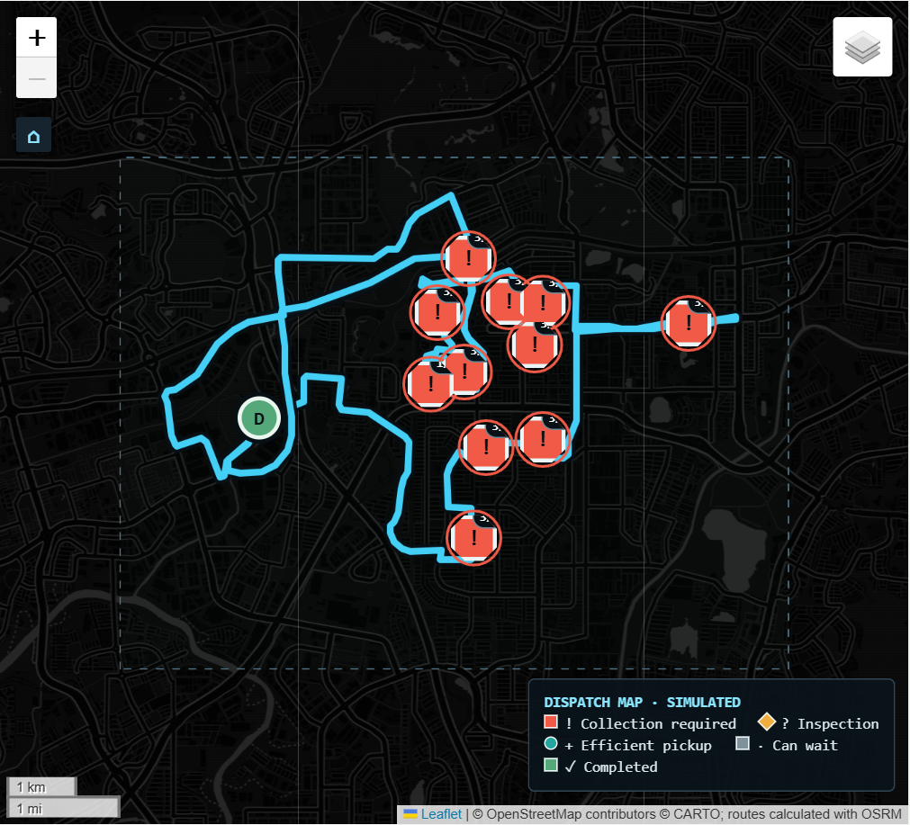

# How BinSight routes are displayed

The portal displays capacity-feasible routes on OpenStreetMap-derived roads and keeps the 11 physical sites visually honest.

## Markers

- There is **one marker per service site**, not one artificially offset marker per bin.
- Each of the 11 markers represents one ESP32 and its three co-located underground bins.
- A marker badge shows how many of those bins need attention, such as `2/3`.
- Opening the popup shows all three bin IDs, fill, weight, time to overflow, risk, confidence, decision reason, and state.
- Site color/shape uses the highest-priority state among its three bins. Text and shape accompany color so the state is not color-only.

Operational states are collection required, inspection required, no collection required, in transit, servicing, completed, and depot. Completed status is applied only after the simulated service-completion timestamp.

## Routes and layers

- Smart routes use a bright cyan operational line with a dark underlay for contrast.
- Fixed routes use a restrained dashed gray comparison line.
- Separate layer controls expose routes, site status, and truck tracking.
- Route popups identify policy, dispatch/trip, and distance.

The map is bounded to the configured Subang Jaya pilot rectangle. Minimum/maximum zoom are 13/18, tile wrapping is disabled, and a reset control returns to the intended service area. This prevents an operator from accidentally losing the pilot among unrelated cities while retaining normal inspection zoom.

## Mock live tracking

The **Mock live tracking** tab converts a representative route event into a chronological manifest. A truck marker interpolates along each road leg using the simulated OSRM travel duration, pauses for eight minutes at each bin, pauses 20 minutes at the depot, and shows turnaround between trips. Controls provide play/pause, reset, a timeline slider, and speed choices.

The tracker is explicitly a replay. It does not receive GPS, command a driver, or change the completed simulation. Reduced-motion settings disable the pulsing truck animation while preserving manual timeline controls.

## Interpretation

The preview is a representative solved dispatch, not a promise that a vehicle will always follow that line. A new validated sensor/forecast snapshot can change the selected bins and the route. Simulation routes use the cached distance/duration matrices; display geometry may fall back to straight stop-to-stop lines if OSRM route geometry is temporarily unavailable.

Supporting files:

- `artifacts/representative_routes.geojson` — representative road polylines.
- `artifacts/representative_route_events.json` — chronological trip/service timeline.
- `artifacts/district_bins.csv` — bin-to-site/controller table.
