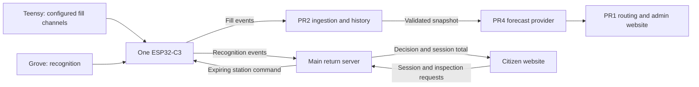

# BinSight Integration Test Plan

Coordinator: Codex, working with the project owner. Created 28 August 2026.

Test branch: [`codex/integration-test`](https://github.com/Rover-Panto/BinSight/tree/codex/integration-test).
This branch starts at `68f12831a3a0551502e78f19df83a509e11af4ff`, the existing documentation and server-policy foundation, which includes `main` at `9fca9d47afb805f40034da970bb47d791ba8f0b4`. It does **not** initially contain PR1-4. Creating it does not approve those PRs or enable hardware operation.

## 1. Decisions and Scope

Keep two applications: the React citizen website in `web/` and the Streamlit operations website in PR1's `admin-portal/`. Do not rebuild either website to join this integration. The whole repository, including both applications and their services, eventually belongs on `main`.

Confirmed requirements:

- One physical recycling-return bin for the technology demo, alongside the general-waste sensing demonstrator; one Teensy 4.1 and one shared ESP32-C3. Retain three-channel capability and three-bin routing fixtures for engineering tests, with additional channels explicitly simulated or unavailable.
- Grove Vision AI V2 runs recognition. The shared C3 receives Teensy UART and Grove I2C traffic through independent modules and queues.
- PR4 owns forecasting. PR1 owns collection decisions, routing, approvals and operational KPIs.
- Main-owned server code owns return sessions, recognition decisions and simulated RM0.20 credits. The citizen does not choose an item category. No camera stream goes to either website.
- Accept plastic, metal and glass at confidence >=0.70 after three consecutive matching samples within five seconds. Other materials reject; the resident can try another item.
- Run a physical demo using the existing one-Teensy, one-ESP, one-Grove arrangement with the laptop as server. Hardware gates H01/H02 are required for demo readiness.
- Include minimal admin ticket closing, backed by a shared report API. This scope is confirmed; the API and admin controls are not implemented yet.
- Preserve existing records and image attachments. Use fictional identities and simulated payouts. Do not add real payment connections, publish services, purchase hosting or merge into `main` during branch preparation.

Owner decisions, updated after the 28 August discussion:

| ID | Status | Decision or remaining question |
| --- | --- | --- |
| D1 | Confirmed | Physical Teensy, shared ESP and Grove; laptop server, using the existing local demonstration arrangement. No public deployment. |
| D2 | Confirmed scope | Minimal admin ticket closing. Main owns report/photo/status storage and API; PR1 owns the operator view. See the detailed scope below. |
| D3 | Confirmed | One physical recycling bin as a technology demonstration. One Grove/camera, one collection bin, one QR station and one active session at a time. No split compartments or sorting diverter. See [the station decision](RECYCLING_STATION_OPTIONS.md). |

The recycling demo accepts supported plastic, metal and glass samples into the same collection bin. Keep their recognised material labels in the ledger; do not claim material separation. Its fill sensor remains independent of recognition. Retain existing three-bin simulation history and IDs, but do not present the extra recycling fixture as a physical station or copy live readings into it. This smaller technology demo does not establish compliance with any separate three-physical-bin submission requirement.

### Physical demo access

Develop and run software preflight on loopback. For the bench demo, configure the required device API listeners on the laptop's local Wi-Fi address, with device authentication and restricted firewall access; an ESP cannot reach the laptop through `localhost`. Keep other services on loopback unless the demo needs them on the LAN. Document the real ports and addresses after implementation and test them before the run.

Use fictional citizen accounts and simulated payments. Mock OTP does not secure a LAN service. Do not expose the admin, shutdown controls or data stores to the public internet. Record the board revisions, wiring, firmware/model hashes, power measurements and recovery results. Both websites still need the main-owned server work before physical data can appear in the citizen flow.

### Minimal report workflow

Give the admin an open/closed filter, report details with retained photos, and a `Close ticket` action with a short resolution note. A closed ticket maps to the existing citizen `Resolved` status. Provide `Reopen` on a closed ticket as a correction path, mapping to the existing `Reviewed` status. Keep the original report and append actor/time/status history; retries must not duplicate updates or notifications.

Main owns authenticated report creation/read/status APIs, attachment storage, ownership checks and persistence. PR1 consumes those APIs through an adapter and owns the minimal controls. Preserve current browser-only reports until an explicit import/migration flow exists. Exclude assignment queues, bulk actions and report deletion from this version. Closing a ticket must not reset fill telemetry or mark a truck route collected.

## 2. Ownership and Connections



| Owner | Deliverable | Do not duplicate |
| --- | --- | --- |
| PR1 | Telemetry consumer, route policy/solver, approval/audit, admin UI, route/KPI simulation, minimal ticket-closing view | PR4 training/features; PR2 gateway/ingestion; citizen sessions, credits or report backend |
| PR2 | Configurable Teensy target retaining three-channel test support, shared C3 shell/network/fill module, telemetry API/storage, diagnostic tools | A second operations dashboard as the product; a separate PR3 firmware image |
| PR3 | Grove model/export evidence, SSCMA recognition adapter, recognition queue and station feedback module | QR/login/session API, acceptance policy, credit ledger or routing |
| PR4 | Installable forecast provider, feature preparation, trained bundle, evaluation and capability declarations | Dispatch decisions, another telemetry store, another operations website |
| Main integration / Codex | Shared contract review, combined C3 build, return and report APIs/storage, citizen client/migrations, integration evidence | Reimplementing contributors' owned algorithms |

Keep the PR2 telemetry dashboard and PR4 model demo as optional developer diagnostics, not additional citizen/admin websites. Inventory PR1's earlier hardware/MQTT and forecast code; retire active duplicates only after their replacement passes tests. Preserve useful tests and historical results.

## 3. Contracts to Implement

Use [the forecast guide](PR1_PR4_FORECAST_INTEGRATION.md), [the gateway contract](SHARED_ESP32_GATEWAY.md), [the hardware handoff](CLAUDE_HARDWARE_ROUTING_HANDOFF.md) and [the recycling contract](PR3_RECYCLING_VISION_REVIEW.md). Resolve conflicts here with the coordinator; do not create a parallel contract in a private branch.

| Boundary | Required agreement |
| --- | --- |
| C3 to PR2 | Versioned fill event; canonical mapping for each physical channel; event/source/boot/sequence identity; original acquisition time plus server receipt time; fill percentage, optional measured kilograms and explicit quality. Preserve IDs on retry; invalid is not empty. |
| PR2 to PR1 | Authenticated read/export, retained history or pagination, units, timestamp normalization and stable registry mapping. PR1 keeps only the read/cache/validation code it needs. |
| PR1 to PR4 | Local Python package/provider, not another HTTP microservice. Pass observed history, configured bins, decision cutoff and input snapshot reference; preserve ingestion cutoff and training provenance. |
| PR4 to PR1 | One forecast per configured bin; consistent output shape; declared target and units; unavailable/cold-start/error states; supported horizons with justified uncertainty/probabilities or explicit missing capability. Hours until a threshold are not fill-growth percentage points. |
| C3 to return server | Implemented simulation-only authenticated `POST /api/v1/recycling/inferences`; main validates binding, identity, freshness and sequence. See `RETURN_API_V1.md`. Physical use and actuator commands remain disabled. |
| Citizen to return server | QR station identity survives mock login; main creates the session and inspection. A small client polls/subscribes for decisions and stops on navigation/finish. Keep a separate mock mode; an API failure must not silently generate a mock acceptance. |
| Return server to C3 | Matching session/inspection/command ID, expiry and terminal outcome. Deduplicate execution; boot/network recovery cannot replay old acceptance. Define removal/re-arm acknowledgement before enabling the next inspection. |
| Citizen/admin reports | Main-owned report/photo/status API with authorisation, audit and retry/concurrent-update protection. PR1 lists/views/closes/reopens; the citizen sees their retained photos and status. Neither app reads the other's browser storage. No automatic upload of existing local records. |

The simulation-only session/inspection/decision API is published in [RETURN_API_V1.md](RETURN_API_V1.md), with a real-HTTP preflight using PR3 metadata. Physical actuator commands are not implemented. PR3 should keep its transport replaceable. No contributor should invent production credentials or a second citizen backend to unblock their branch.

For routing, preserve 100% as overflow and 90% as an urgent-service trigger until a reviewed policy change says otherwise. A model trained on time-to-90% cannot declare time-to-100% through a function argument. Unsupported horizons/probabilities must select PR1's named non-ML fill/health mode, not fabricated confidence.

## 4. Contributor Workflow and Merge Order

1. Continue fixes on the existing PR branches. Keep PR bases on `main`; do not retarget all PRs to the test branch or merge the aggregate test branch back into your feature branch.
2. Read this plan and reply to your PR coordination comment with your owned changes, dependencies and interface questions. Reference the relevant test IDs below.
3. Commit code, tests and documentation together. Report the exact head SHA and commands/results, including failures and skipped hardware tests. Do not re-add ignored proposal files or real data.
4. Codex reviews the new head before staging it. Record the accepted SHA in `integration/candidate.json`; no blanket approval carries forward after a contributor pushes again.
5. On a clean test branch, stage **reviewed** commits with normal merges that preserve history. Record each component SHA and integration fixes. Do not use wholesale ours/theirs conflict resolution, force-push the shared branch, or delete contributor work.
6. If combined changes fail, retain diagnostic evidence and coordinate a fix on the owning PR. Use a reviewed revert when necessary; do not reset away shared history.
7. Run component tests plus the relevant end-to-end gates on the exact combined candidate. Reset affected passed gates, including G01, when staging new code or changing a candidate SHA; earlier evidence remains historical. Missing components, skipped tests and mock-only checks do not prove integration.
8. After owner approval, merge focused ready PRs into `main` one at a time, then rerun regression tests. Do not merge the entire staging branch as a shortcut around those reviews. Ship integration fixes as focused changes with their own evidence.

Recommended dependency order: foundation/contracts, then PR2 and PR4 once independently ready, then PR1's tested consumer integration. PR3 can progress alongside these; its return workflow also depends on the main-owned API and combined gateway. Use recorded/simulated inputs before the bench test. A reviewed isolated component can merge with live integration disabled; full-system readiness is a separate gate.

## 5. Test Matrix

Each gate starts `not_run`. Record pass/fail against exact code and fixture revisions, with a command and retained result. An existing unit test is only part of a gate where the gate also names transport, persistence, browser or hardware behavior.

| Gate | Owners | Required result before calling it passed |
| --- | --- | --- |
| G01 Foundation regression | Main | Server policy and integration fixture tests pass; citizen lint, unit, browser and build checks pass. Login, reports, saved photos, returns and mock payouts survive reload. |
| G02 Fill producer | PR2 | Configurable enabled channels with stable IDs/types; retain three-channel host/bench coverage without claiming three physical bins. Fill-only payload accepted; absent/invalid input stays unavailable; sustained deposit/collection steps recover within a documented bound. Fix the existing wiring, RTOS, config, serial, retry, time, calibration and stale-display findings. |
| G03 Fill to route | PR2/PR4/PR1 | A labelled recorded/synthetic three-bin history passes real ingestion/read, registry mapping and installed provider into a route preview. Separately verify actual demo-bin telemetry. Preserve source mode, acquisition time/quality and missing-bin states; no vision event enters this path and no extra live bin is fabricated. |
| G04 Forecast semantics | PR4/PR1 | Threshold, percentage-point growth, hours, horizon and probability meanings match. Reject incompatible bundles; no future-observed, late-ingested or future-trained evidence enters historical decisions. Cold start/gaps/invalid values select an explicit supported state. |
| G05 Route lifecycle and KPIs | PR1 | Refresh/restart cannot double-dispatch or overwrite an approved route. Service state ages out. Matched fixed/priority simulations record seeds, input/model revisions and complete outcomes, including regressions. Missing data/zero baselines stay explicit. |
| G06 Session to credit | Main/PR3 | QR login handoff creates a station-bound session; three matching samples at exactly 0.70 produce one stored decision and one 20-sen credit. Duplicate/reordered retries, concurrent requests, restart and lost acknowledgement cannot credit twice. Policy-only tests do not satisfy this gate. |
| G07 Rejection and citizen recovery | Main/PR3 | Paper/other, multiple items, low confidence, no object, wrong/expired session and timeout never add credit. Rejection permits another inspection after re-arm; finish/navigation stops polling; no browser camera access or user material selection. |
| G08 Gateway host/compile | PR2/PR3/Main | Clean pinned Teensy and single combined C3 builds; host tests for independent streams, bounded queues, fair networking, identity preservation, expiry, malformed input and per-peripheral fault containment. No second C3 image. |
| G09 Access and secrets | Main/PR1/PR2 | Device authentication and user/station ownership checks; admin-only operations; loopback URL parsing rejects lookalike hosts. No real NID, keys, payment details, photos or raw tokens in logs/fixtures/Git. Mock OTP is not network security. |
| G10 Data preservation | Main/PR1/PR2 | Back up before migrations; old citizen schemas and photos survive; legacy bottles do not acquire invented materials; telemetry/route history persists. Future schemas fail safely. Backup/restore and rollback run on copies. |
| G11 Model delivery | PR3/PR4 | Reproducible install outside repository cwd; approved artifact origin/hash and class/features/target/dependency versions agree before loading. Held-out results distinguish synthetic data, calibrated probabilities and actual hardware evidence. |
| G12 Runtime and operations | Main/all | Document commands/config/ports/health for both websites and required services; start/stop only owned processes, preserve records, no import-time training. Citizen Account cannot become an unauthorised whole-stack shutdown endpoint. Resource usage is measured on the demo laptop. |
| G13 Shared report workflow | Main/PR1 | Citizen photo report reaches authorised admin; close with a resolution note and reopen persist across reload/restart, retain photos/history and return one status notification to its citizen. Unrelated users cannot read it. Retry/concurrent updates cannot lose changes. Closing does not alter fill or route service state. |
| H01 Concurrent hardware | PR2/PR3/Main | On the actual board, fill reporting continues during Grove inference and servo/network activity; each peripheral fault is bounded; shared power/reset affects both streams and recovers without stale acceptance. Record pins, current, queue limits and firmware hashes. |
| H02 Physical item handling | PR3/Main | One recycling bin and deployed Grove artifact/class map match evidence. Test plastic/metal/glass and rejects under demo lighting; one held item cannot re-credit; removal/re-arm and loss of power/network leave any acceptance gate non-accepting. Test accept/reject handling, not material-diverter destinations. |

Rejected-item fraction is a **rejection-rate proxy**, not a measured recycling-contamination rate. Do not claim cleaner material streams without ground truth. Similarly, modelled fuel/CO2 and sensing-energy estimates need stated assumptions and are not measurements.

## 6. Checks Available on This Branch

Run from the repository root:

```powershell
python -m pip install -r server/requirements.txt
python -m unittest discover -s server/tests -v
python -m unittest discover -s integration/tests -v
python -m integration.return_preflight
python -m integration.check_readiness
```

Run from `web/` after `pnpm install --frozen-lockfile`:

```powershell
pnpm lint
pnpm test:run
pnpm test:e2e
pnpm build
```

Playwright starts and stops its own test server when the test port is free. Do not point these tests at an existing personal-data browser/session or stopkill unrelated processes to free a port. The foundation workflow runs these same checks in isolated GitHub runners. Its green result means **foundation regression passed**, not G02-H02 passed.

`integration/candidate.json` records candidate PR heads, `demo_mode: physical` and outstanding gates. `python -m integration.check_readiness --require-ready` requires software AND physical gates for this demo. Use `--software-only` for an explicitly labelled preflight; it does not establish physical demo readiness. `--hardware` can also request hardware gates explicitly. This is a ledger/ancestry check, not a substitute for running tests or permission to merge. The owner must approve decisions and merge readiness.

Contributors add real component and cross-service test commands as implementations land; do not satisfy this plan with tests that only assert mock responses or file existence. Pin the fixture revision and both producer/consumer versions. Hardware tests may remain pending during development, but not for the owner-confirmed physical demo.

## 7. Evidence and Next Handoff

Use [the baseline record](INTEGRATION_BASELINE_2026-08-28.md). For each new result include: gate ID, candidate/component SHAs, command/environment, fixture/model hash, expected/observed outcome, log or CI link, data-impact check and remaining limitations. Store sanitised evidence under `integration/evidence/` or attach it to the PR; keep generated reports, databases and photos out of Git.

Implemented on the test branch: simulation-only session/inspection API, durable decision/credit storage, station authentication/polling/removal acknowledgement, isolated preflight and a loopback launcher. Main-owned backlog: citizen mock/API client and QR handoff, versioned history migration, simulated payout integration, report/photo/status API and audit, expiring actuator commands, shared gateway assembly and a coordinated local runtime. Exact wiring, optics and acceptance-gate design still need bench verification. See [the latest review](INTEGRATION_REVIEW_LATEST.md); partial API evidence does not mark full software or physical gates passed.
