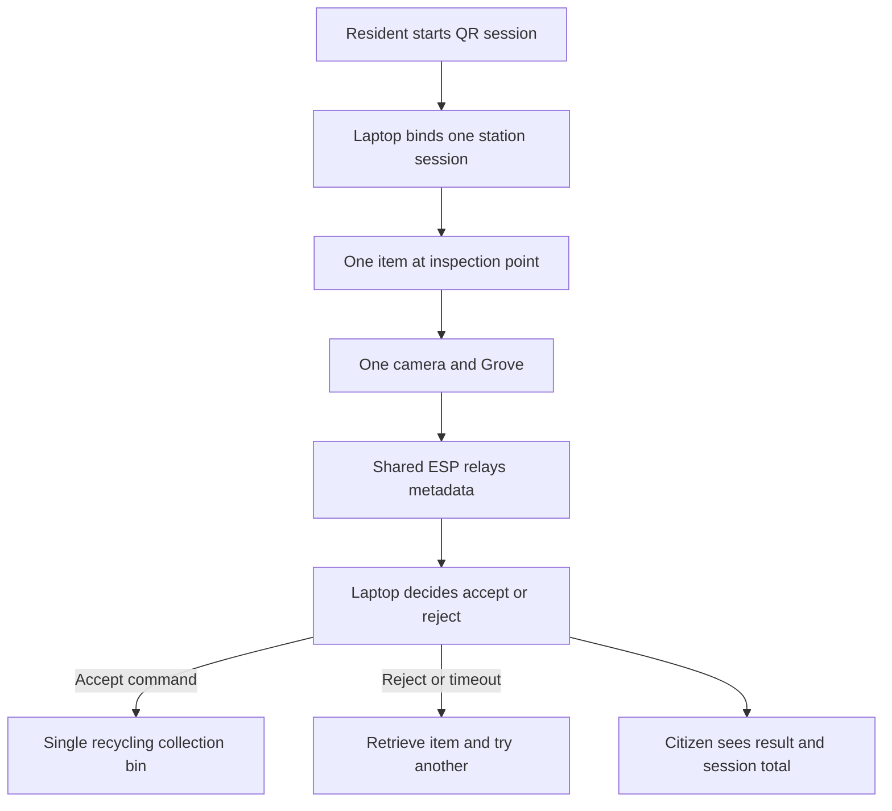

# Recycling Technology Demo Decision

Status: D3 confirmed by the owner on 28 August 2026. Implementation and physical tests remain pending.

## Selected layout

Use **one physical recycling bin as a technology demonstration**. One camera/Grove inspects one item at a time; the shared ESP relays results to the laptop server. Keep the general-waste sensing demonstrator separate. No split compartments, material-sorting diverter, second camera or second Grove are required.

The accepted plastic, metal and glass samples use the same collection bin. Keep their recognised material labels in the session ledger. Demonstrate recognition, acceptance/rejection, event delivery and simulated payment, not automated separation into material streams. This decision supersedes the earlier plastic-plus-metal / separate-glass recommendation.

## Return flow

Use one configured QR station identity, bound to the actual recycling bin ID, with one active session and inspection at a time. Grove identifies the item; the citizen does not choose a material. The browser receives result metadata, never a camera stream.

The server policy stays unchanged: accept `plastic`, `metal` or `glass` at confidence >=0.70 after three consecutive matching results within five seconds. Reject other materials; timeout or low-confidence outcomes do not add credit. The server owns one durable decision and at most one simulated RM0.20 credit per inspection.

Fill sensing on the recycling bin remains independent of recognition. Teensy provides its fill reading for PR2 ingestion and PR4/PR1 routing. The same ESP carries both streams through separate modules, queues, identities and endpoints. Fill level is not an input to the material decision.

## Contributor responsibilities

| Owner | Demo requirement |
| --- | --- |
| PR2 | Configure the actual live sensing channels; keep three-channel capability for tests. Unfitted channels remain disabled/unavailable, not empty or copied from another sensor. |
| PR3 | Deliver and test one deployed Grove model, one recognition adapter and accept/reject feedback through the shared C3. No material-diverter or two-Grove bus work. |
| PR1 | Show one live recycling asset/collection stop. Keep existing multi-bin scenarios separate as simulations; do not turn material labels into extra physical bins. |
| PR4 | Forecast per configured fill channel and retain synthetic multi-bin tests. No QR, vision or material-sorting dependency. |
| Main integration | Publish the single-station session, inspection, inference and expiring-command contracts; persist decisions and simulated credits; connect the citizen client. |

Retain the existing three-bin fixture and its IDs/history for engineering coverage. Extra scenario bins must remain labelled synthetic/replay, not physical measurements. Keep physical-demo, replay and district-simulation profiles distinct. This smaller technology demonstration does not establish compliance with a separate requirement for three physical instrumented bins.

## Physical tests and budget

- Test actual camera focus and lighting, class mapping, rejects and timeouts on the delivered Grove model.
- Verify rejection permits item retrieval and a new inspection. A held item, retried message or lost acknowledgement must not create another credit.
- Test any acceptance gate for safe reset, jam handling and bounded motion while fill reporting continues. A gate is not a material-sorting diverter; its mechanics still need validation.
- Keep the difference between recognition and physical deposit explicit. A drop-confirmation sensor remains a proposed improvement, not an approved purchase or an implemented credit condition. Do not claim verified deposit without evidence or silently alter credit timing.
- Retain the one-Teensy, one-ESP and one-Grove/camera [budget baseline](HARDWARE_BUDGET_LOCAL_SOURCING.md). The third sensing kit remains a conservative spare/bench allowance; it does not require another physical recycling bin. Recheck final quantities before purchasing.

H01/H02 remain required for the physical demo. Confirming D3 does not pass those gates, merge any PR or prove the return backend is implemented.

## Earlier alternatives

Separate Grove stations, a split station and a camera overlooking two openings are outside this demo. Their earlier comparison remains in [Git history](https://github.com/Rover-Panto/BinSight/blob/67ca05e/docs/RECYCLING_STATION_OPTIONS.md), not the active implementation backlog. A future installation may use one Grove per recycling bin, as the owner previously described; it needs its own deployment and budget review.
