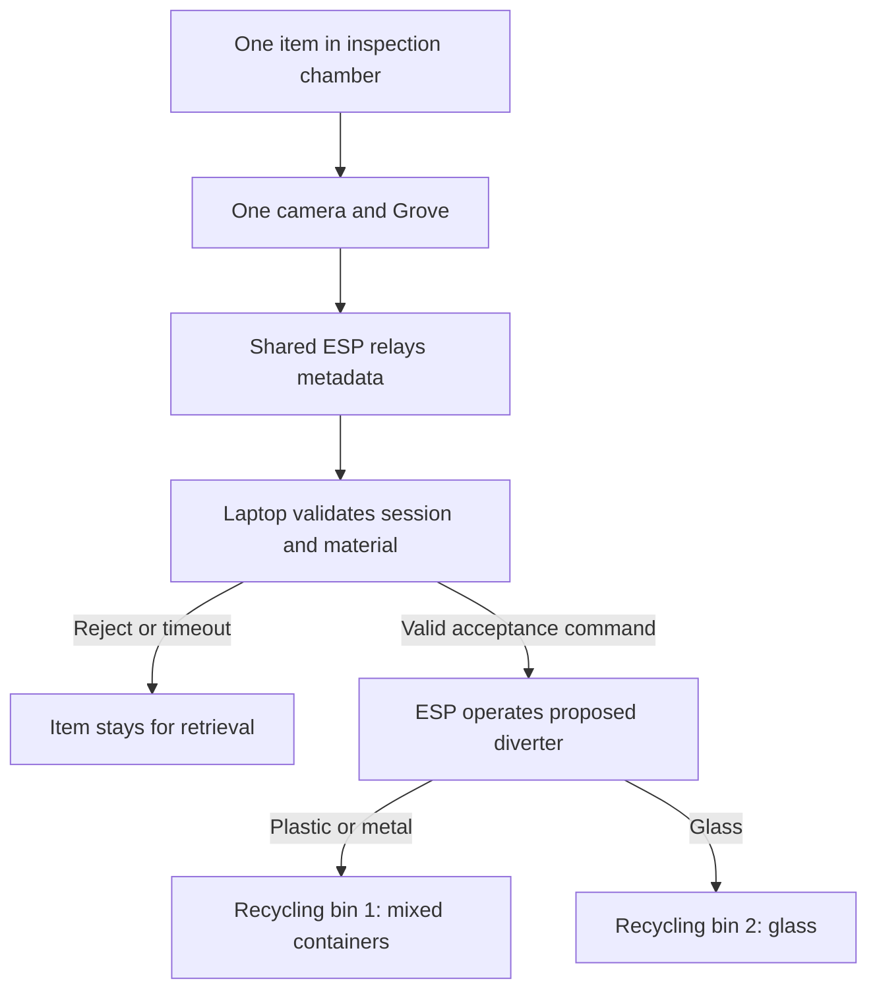

# Recycling Station Layout Options

Status: proposed, awaiting owner decision D3. Prepared 28 August 2026.

## Context and constraints

The owner confirmed a physical demo with one Teensy, one shared ESP and Grove hardware connected to a laptop server. They expect one Grove per recycling bin in a future installation, but want to consider a split-bin design. This note compares layouts; it does not change the acceptance policy, buy hardware or implement a chute.

Keep one general-waste bin and two independently fill-sensed recycling bins. The general-waste bin has no vision model. Grove runs recognition; the ESP relays results; main decides acceptance and owns the session and simulated RM0.20 credit. PR2 fill data still feeds PR4/PR1 independently of recognition.

The current [budget](HARDWARE_BUDGET_LOCAL_SOURCING.md) includes one Grove/camera, one SG90 and a shared enclosure reserve. Keep that baseline until the owner selects a layout and the team checks its mechanics and cost.

## Options

| Layout | Vision stacks | Main benefit | Main cost or limitation |
| --- | ---: | --- | --- |
| A. Separate recycling stations | 2 | Independent inputs and sessions | Second stack exceeds the current working budget |
| B. One inspection opening, two removable bins | 1 | Matches current electronics count | Diverter, one user at a time, two collection streams |
| C. One camera overlooking two openings | 1 | Avoids a second stack | Ambiguous item/session binding and obstructed views |

### A. Separate recycling stations

Each recycling bin gets a camera/Grove, an input and a station identity. This matches the owner's future-installation direction. Independent optics make it easier to associate an item with its station, and two people could use separate stations after concurrency and power tests. Each station still needs a defined list of supported materials and physical feedback; two Groves do not create a third collection compartment.

A second Grove is RM95 and the listed camera is RM29 at the 28 August check. Adding the budgeted RM1.50 cable makes the extra stack RM125.50. Holding the other dated budget lines fixed gives `(415.35 + 125.50 + 15 + 40) * 1.10 = RM655.44`, before extra actuation or bus hardware. That exceeds the existing RM603.53 working ceiling; it is a comparison estimate, not a refreshed checkout quote.[^1][^2]

Sharing the same ESP remains plausible for a compact bench, but two Groves cannot simply share the default I2C address. Seeed's SSCMA header uses `0x62`. Although the host API accepts an address argument, that does not establish that the selected Grove firmware supports readdressing. A channel-selecting I2C switch such as TCA9548A is one candidate for isolating same-address devices; verify switching, pins, recovery and board/library versions before adding it.[^3][^4]

For physically separated future stations, review local networking nodes at each location instead of extending the bench's shared wiring. That deployment review is outside the current USD150 demo and does not authorise a second ESP here.

### B. Shared inspection chamber and split station

My recommendation for the current demo is one controlled insertion opening above two removable recycling bins. One camera/Grove inspects the item. Following the server decision, the ESP operates a diverter to the intended compartment. The separate general-waste bin remains unchanged, so there are still three measured bins.

Proposed grouping: **plastic and metal together; glass separate**. This is a demo collection-stream choice, not a claim about a municipal sorting requirement. The model and ledger still distinguish plastic, metal and glass. Two compartments cannot demonstrate three-way material separation; three separate recycling streams would require another compartment and a scope/budget review.

Use one QR identity for the shared return station and one active session/inspection at a time. Keep separate asset IDs and fill channels for each compartment. Record a destination bin separately from the recognition source and station; do not pretend the camera belongs to two independent insertion points.

The tradeoff is mechanical work. A diverter needs a safe default position, a retrievable rejection path and bounded motion. The budget's single SG90 is only a candidate: the team must test whether the mechanism needs a separate holding gate, another actuator or position sensing. Do not assume that servo can support or divert a full-size glass bottle. Test with contained, low-energy samples first; glass and pinch-point tests need a guarded mechanism.

### C. One camera above two openings

I do not recommend this for the first demo. The team would need to prove which opening produced each detection, handle simultaneous insertions and prevent one resident's item from joining another session. Current policy rejects multiple detected objects. Locking one opening at a time and adding position sensing could resolve some ambiguity, but then the design needs additional access-control mechanics. A camera pointed at both bins is not sufficient session binding.

## Integration consequences

| Owner | Required preparation while D3 is open |
| --- | --- |
| PR2 | Preserve three calibrated fill channels and one shared gateway target. Do not hardcode recycling material assignments from a simulation profile. |
| PR3 | Keep Grove source/station identity configurable. Deliver metadata, not browser video. Do not implement an unapproved two-Grove bus layout or decide credits locally. |
| PR1 | Keep physical bin IDs, location/station grouping and collection streams distinct. Two compartments at one site need an explicit route-service grouping, not an assumed extra vehicle trip. |
| PR4 | Forecast per configured fill channel; no vision or QR dependency. Layout changes must not alter forecast units or target semantics. |
| Main integration | Publish station/session/inspection and command bindings after layout approval. One shared chamber needs a station lock; separate stations need independently tested locks. |

The existing material decision stays plastic/metal/glass at >=0.70 with the agreed stability window. It does not use fill readings. Any jam/door/availability interlock belongs to physical handling and must be specified separately; it must not silently change the classifier policy or merge the telemetry and recognition queues.

## Bench gates and remaining decision

- Verify the camera at the actual inspection distance before fixing the chamber dimensions. The current camera listing specifies fixed focus from 1 m to infinity, so close-range recognition remains unproven.[^2]
- Demonstrate one-item restraint, retrieval after rejection, destination selection, jam handling, removal/re-arm and no stale motion after network loss or reset. Keep fill reporting active during these tests.
- Distinguish recognition from deposit. Seeing an accepted item does not prove it fell into a bin. I recommend a drop-confirmation sensor and a separate deposit acknowledgement before credit in the next contract revision. The current policy grants a simulated value on recognition; do not claim verified physical deposit or silently change credit timing without a reviewed update.
- Measure combined current and actuator loading. Recheck the BOM with any added gate, sensor, lighting, wiring or close-focus camera. No option is mechanically validated by its parts list.

**Owner decision needed:** approve or revise the shared-chamber recommendation and its proposed plastic-plus-metal / glass grouping. Until then D3 remains pending, the budget retains one Grove, and contributors can repair their existing modules without committing to a chute layout.

## Sources

[^1]: Cytron, [Grove AI Vision Module V2](https://my.cytron.io/p-grove-ai-vision-module-v2), checked 28 August 2026: RM95. The RM1.50 cable and other unchanged lines come from the repository's dated [budget baseline](HARDWARE_BUDGET_LOCAL_SOURCING.md).
[^2]: Cytron, [5MP OV5647 camera](https://my.cytron.io/p-5mp-camera-board-for-raspberry-pi), checked 28 August 2026: RM29; fixed focus, 1 m to infinity.
[^3]: Seeed Studio, [SSCMA library header](https://github.com/Seeed-Studio/Seeed_Arduino_SSCMA/blob/main/src/Seeed_Arduino_SSCMA.h), checked 28 August 2026: default I2C address and transport constructor. Pin the version when implementing.
[^4]: Texas Instruments, [TCA9548A](https://www.ti.com/product/TCA9548A), eight-channel I2C switch. This is a connectivity candidate, not an approved local purchase or tested Grove adapter.
