> **Note:** This is a standalone hardware / edge-to-cloud pipeline (Teensy
> 4.1 firmware, a FastAPI ingestion service, and a Streamlit dashboard),
> developed as a separate track from the citizen-facing web app in `web/`.
> It has no dependency on the web app's React/TypeScript code, storage
> keys, or routes, and is not the `/admin` module described in
> `docs/ADMIN_INTEGRATION.md` — that is still planned as a client-side
> React module inside `web/src/admin/`. See the root `README.md` for the
> overall project.

# BinSight — Edge-to-Cloud Smart Waste Management System

An end-to-end pipeline: a Teensy 4.1 running a custom preemptive
RTOS-style task scheduler collects and packages sensor telemetry, streams
it over USB serial to a laptop bridge script, which forwards it to a
FastAPI cloud ingestion service, visualized live on a Streamlit dashboard.
This package covers ingestion and validation only — the cloud-hosted
ML overflow-risk model is a future phase; the dashboard has a clearly
labeled placeholder where it will plug in.

> **No Ethernet/WiFi hardware assumed** (for the USB-serial path — an
> optional ESP32 Wi-Fi gateway is available too, see below). The available
> parts list is Teensy 4.1, 1x ultrasonic sensor per bin **(changed
> 2026-08-28 from 2x — see "Known changes" below)**, 1x push button
> (calibrate/reset) **(changed 2026-08-28 from 3x — see "Known changes"
> below)**, breadboard, jumper wires. `tools/serial_bridge.py` bridges the Teensy's
> USB-serial telemetry stream to the cloud backend over HTTP, so no extra
> hardware is required. See `SETUP_AND_WIRING_GUIDE.md` for full step-by-step
> instructions, including the wiring diagram and safety notes.

## Architecture

```mermaid
flowchart LR
    subgraph Teensy41["Teensy 4.1 — Edge (FreeRTOS, 3 prioritized tasks)"]
        T1["Task 1: Sensing\n(HIGH priority)\nultrasonic x1, button x1 (calibrate)\nconfidence_flag, estimated_density"]
        T2["Task 2: Filter & Package\n(MEDIUM priority)\nmoving avg + sanity filter\nJSON schema packaging"]
        T3["Task 3: Secure Transmit\n(LOW priority)\nframed JSON, sent independently\nover USB serial AND ESP32 UART"]
        T1 -- "RawReading\n(queue)" --> T2
        T2 -- "PackagedReading\n(queue)" --> T3
    end

    T3 -- "USB serial\nBINSIGHT:&lt;json&gt;" --> BRIDGE["tools/serial_bridge.py\n(laptop)\nadds X-API-Key"]
    T3 -- "UART (Serial3)\nBINSIGHT:&lt;json&gt;" --> ESP["ESP32 Gateway\n(added 2026-08-28)\nWi-Fi + adds X-API-Key"]
    BRIDGE -- "POST /api/v1/telemetry" --> API["FastAPI Cloud Backend\nvalidate (Pydantic) -> SQLite"]
    ESP -- "POST /api/v1/telemetry" --> API
    API -- "GET /api/v1/bins/summary\nGET /api/v1/telemetry/{bin}/history" --> DASH["Streamlit Dashboard\nmetrics, charts, raw log"]
    API -- "GET /api/v1/bins/summary\nGET /api/v1/telemetry/{bin}/history" --> ROUTE["Kai's routing system\n(reads via the same API)"]
    API -.future.-> ML["Cloud ML model\n(overflow risk)"]
    ML -.future.-> DASH
```



## Why a "pseudo-density" proxy

There is no physical load cell (budget/time constraint). `estimated_density`
is derived on-device from a fixed baseline plus the ultrasonic fill-rate
delta (fast fill = nudges the estimate up, modeling compaction/heavy waste
arriving quickly). **[Changed 2026-08-28]** Earlier revisions picked the
baseline from a manual waste-type classification (heavy/wet vs.
dry/recyclable) injected via two push buttons — that's been removed (see
"Known changes" below); `estimateDensity()` now always starts from the
single `DENSITY_BASELINE` constant in `config.h`. It is a relative
engineering proxy, not a calibrated kg/L measurement — this is stated in
the firmware comments, the API schema docstrings, and the dashboard
caption so it's never mistaken for a real density sensor reading.

## Repository layout

```
hardware_pipeline/
├── firmware/BinSight_Teensy41/     Teensy 4.1 Arduino/Teensyduino sketch
├── firmware/BinSight_ESP32_Gateway/  ESP32 Wi-Fi gateway sketch (added 2026-08-28)
├── cloud_backend/                   FastAPI ingestion & validation service
├── dashboard/                       Streamlit live visualization app
└── tools/serial_bridge.py           USB-serial -> HTTP bridge (laptop-side)
```

## 1. Firmware (`firmware/BinSight_Teensy41/`)

**Board:** Teensy 4.1, via Arduino IDE + Teensyduino (or PlatformIO with the
`teensy41` board target).

**Required libraries** (Arduino Library Manager):
| Library | Purpose |
|---|---|
| FreeRTOS_TEENSY4 (tsandmann/freertos-teensy) | preemptive scheduler w/ explicit priorities |
| Bounce2 | push-button debouncing |
| ArduinoJson | payload serialization |
| Time | wall-clock timestamps (sync via the Teensy's battery-backed RTC) |

**Task architecture** — 3 tasks, explicit priorities, one-directional queues
so a slow/degraded transport (Task 3) can never stall sensing (Task 1):

| Task | Priority | Period | Responsibility |
|---|---|---|---|
| 1. Sensing | High (3) | 200 ms | Poll 1x ultrasonic + 1x calibrate button, compute `confidence_flag` and `estimated_density` |
| 2. Filter & Package | Medium (2) | 500 ms | Moving-average + sanity filter, package into the JSON schema with timestamp + `bin_id` |
| 3. Secure Transmit | Low (1) | 2000 ms | Frame + write JSON over USB serial for `tools/serial_bridge.py` to forward |

**Before flashing:** calibrate `BIN_EMPTY_DISTANCE_CM` / `BIN_FULL_DISTANCE_CM`
in `config.h` for your bin's geometry. No API key/host config is needed on
the MCU — that lives in `tools/.env` (see below).

## 2. Cloud Backend (`cloud_backend/`)

```bash
cd cloud_backend
python -m venv .venv && source .venv/bin/activate
pip install -r requirements.txt
cp .env.example .env   # fill in BINSIGHT_API_KEY / BINSIGHT_HMAC_SECRET
uvicorn app.main:app --reload --host 0.0.0.0 --port 8000
```

Interactive docs at `http://localhost:8000/docs`.

| Endpoint | Method | Purpose |
|---|---|---|
| `/api/v1/telemetry` | POST | Ingest one reading (device-authenticated) |
| `/api/v1/bins` | GET | List known `bin_id`s |
| `/api/v1/bins/summary` | GET | Latest reading + stats per bin (drives the dashboard) |
| `/api/v1/telemetry/{bin_id}/latest` | GET | Latest reading for one bin |
| `/api/v1/telemetry/{bin_id}/history` | GET | Chronological history for charting |
| `/health` | GET | Liveness check |

Validation (Pydantic, `app/schemas.py`): rejects any payload that doesn't
match the exact schema — `fill_pct` clamped to [0,100], `confidence_flag`
restricted to `{0,1}`, `bin_id` pattern-matched, timestamp must be
timezone-aware, unknown fields rejected outright. Storage is SQLite by
default (`binsight.db`, zero external infra needed for the demo) with a
unique `(bin_id, timestamp)` constraint that makes re-sends idempotent.

## 3. Dashboard (`dashboard/`)

```bash
cd dashboard
pip install -r requirements.txt
streamlit run streamlit_app.py
```

Point the sidebar's "Cloud backend URL" at your running FastAPI instance
(defaults to `http://localhost:8000`). The dashboard auto-refreshes,
shows fleet-wide metric cards, a per-bin overflow-risk badge (a threshold
placeholder for the future ML model), fill-level and density time-series
charts (one fixed color per bin), and a raw telemetry log with
low-confidence readings flagged by icon + label.

## 4. Serial Bridge (`tools/`)

```bash
cd tools
pip install -r requirements.txt
cp .env.example .env   # fill in SERIAL_PORT, BINSIGHT_API_KEY (must match cloud_backend/.env)
python serial_bridge.py --list-ports   # find the Teensy's COM port
python serial_bridge.py                # start bridging (reads tools/.env)
```

Reads `BINSIGHT:<json>` framed lines from the Teensy's USB serial port and
POSTs each one to `/api/v1/telemetry` with the `X-API-Key` header attached.
Any other serial line (boot messages, Task 1's per-sample debug prints) is
echoed to the console with a `[teensy]` prefix instead of being forwarded.
A reading that fails to send due to a network error (not a schema
rejection) is queued to `pending_readings.jsonl` and retried automatically
on the next frame — see "Known fixes applied in this branch" below.

## 5. ESP32 Wi-Fi Gateway (`firmware/BinSight_ESP32_Gateway/`) — added 2026-08-28

An **additional**, independent path to the same cloud backend — not a
replacement for the serial bridge above, which is untouched and keeps
working with or without this board present.

The Teensy's Task 3 now writes each reading to a second UART
(`esp_link.h`/`.cpp`, Serial3) in parallel with the existing USB-serial
write. A separate ESP32 dev board, wired to that UART, joins Wi-Fi and
POSTs the same reading to the same `/api/v1/telemetry` endpoint with the
same API key and schema — this is what lets the system run untethered
from a laptop. See `SETUP_AND_WIRING_GUIDE.md` Part D for wiring and setup,
and the sketch's own header comment for the full protocol/design notes.

**Where routing fits in:** this gateway doesn't talk to Kai's routing
system directly — it only gets readings into the shared cloud backend.
The current assumption (stated in the sketch's header comment, worth
confirming with Kai) is that the routing system reads bin state back out
via the backend's existing `GET /api/v1/bins/summary` /
`GET /api/v1/telemetry/{bin_id}/history` endpoints, the same way the
dashboard does — i.e. no new integration point is needed on the firmware
side. If routing actually needs a push-style delivery or a different
schema, that changes this design and should be confirmed before relying
on it.

## Data flow summary

1. Task 1 samples sensors every 200 ms, computing `confidence_flag` and
   `estimated_density` on-device.
2. Task 2 drains the raw queue, smooths + sanity-checks the values, and
   packages a JSON payload matching the exact ingestion schema.
3. Task 3 drains the packet queue and writes each one as a framed line to
   BOTH USB serial and the ESP32 UART link, independently, without ever
   blocking Tasks 1/2.
4. `serial_bridge.py` on the laptop reads USB frames and POSTs them to the
   cloud backend with the API key attached; the ESP32 gateway does the
   same for its own UART frames over Wi-Fi. Either path alone is enough
   to get a reading to the backend.
5. FastAPI validates and stores each reading in SQLite, idempotently (so
   a reading that happens to arrive via both paths is stored once).
6. Streamlit polls the FastAPI query endpoints and renders the live view;
   the routing system reads the same endpoints to plan collection routes.

## Known fixes applied in this branch

- `cloud_backend/app/security.py`'s `verify_api_key` had its actual key
  comparison commented out, so any `X-API-Key` header value was accepted —
  device authentication wasn't actually enforced. Restored to a
  constant-time comparison against the provisioned key.
- `filters.h`'s fill-level filter could permanently freeze after a large
  deposit or a bin collection (any single-sample jump bigger than
  `MAX_FILL_PCT_JUMP_PER_SAMPLE` was held indefinitely, with no recovery
  path). It now reacquires after a few consecutive sustained rejections
  instead of freezing forever. A related bug fed a fabricated `0.0f` into
  the filter on invalid readings instead of actually holding the last
  good value — fixed alongside it.
- `serial_bridge.py` used to silently drop a reading if the cloud backend
  was unreachable (Wi-Fi/HTTP failure). Failed sends are now queued to
  `pending_readings.jsonl` and retried automatically once the backend is
  reachable again.

## Known changes in this branch

- **2026-08-28 — single ultrasonic sensor per bin.** Previously each bin
  used 2x HC-SR04 sensors, cross-checked against each other to derive
  `confidence_flag` (disagreement between them meant a likely blockage or
  angled echo). Now there's one sensor per bin: `config.h` no longer
  defines `US2_TRIG_PIN`/`US2_ECHO_PIN` (freeing pins 4/5) or
  `US_SENSOR_DISAGREEMENT_CM`, `types.h`'s `RawReading` no longer carries
  `us2_distance_cm`, and `sensors.cpp`'s `computeConfidenceFlag()` now
  takes a single reading. **Trade-off:** `confidence_flag` now only
  catches an outright timed-out/out-of-range reading — it can no longer
  detect a single sensor giving a plausible-but-wrong reading (e.g. an
  angled echo off waste near the rim) the way disagreement with a second
  sensor used to. If that detection matters for the demo, worth revisiting
  with a different heuristic (e.g. consistency across consecutive
  samples) rather than assuming this is a like-for-like swap. See
  `SETUP_AND_WIRING_GUIDE.md` Part B for the updated (simpler) wiring.

- **2026-08-28 — rescaled for a small top-mounted demo bin (revised twice
  same day).** `BIN_EMPTY_DISTANCE_CM` / `BIN_FULL_DISTANCE_CM` in
  `config.h` moved from the original full-size-bin values (80.0 / 8.0),
  to an initial small-demo-bin pass (8.0 / 2.5), to the current values:
  **30.0 / 4.0** — sensor mounted ~30cm above the empty bottom, "full to
  the brim" at 4cm. `sensors.cpp`'s `distanceToFillPct()` needed no
  changes across any of these — it's a generic linear map between the two
  constants, so re-tuning bin geometry is always just a config change.
  The intermediate 2.5cm "full" value was flagged as too close to the
  HC-SR04's ~2.0cm datasheet minimum sensing distance (only 0.5cm
  margin, risking unstable near-field readings); the current 4cm value
  keeps a safer 2cm margin above that minimum. Re-measure and update
  both constants again for any different physical bin or mounting
  height — don't assume these transfer.

- **2026-08-28 — added `estimated_weight_proxy`.** A relative weight
  proxy (`estimated_density x sensed volume`, where volume is the fill
  height derived from the calibrated `BIN_EMPTY_DISTANCE_CM`/
  `BIN_FULL_DISTANCE_CM` span times the bin's cross-section area from the
  new `BIN_DIAMETER_CM` constant) computed in `sensors.cpp`'s
  `estimateWeightProxy()`, added to Task 2's JSON payload, and threaded
  through the cloud schema/model/CRUD (`estimated_weight_proxy`, a
  required `NOT NULL` column — see `models.py`'s module docstring for the
  SQLite migration gotcha this creates for an existing `binsight.db`) and
  a new dashboard chart/table column. **Not a calibrated kg figure** —
  same "relative proxy" caveat as `estimated_density`, documented at every
  layer.

- **2026-08-28 — removed the manual waste-type buttons and the density
  baseline they drove.** The two Heavy/Wet (pin 6) and Dry/Recyclable
  (pin 7) push buttons, the `WasteTypeHint` enum, `RawReading.waste_hint`,
  and `pollWasteClassification()` are all gone from the firmware.
  `estimateDensity()` no longer takes a classification hint — it always
  starts from the single `DENSITY_BASELINE` constant in `config.h` (the
  two old per-classification baselines and `DENSITY_CLASSIFICATION_HOLD_MS`
  are removed too) and applies the same fill-rate-delta adjustment as
  before. Only the Calibrate/Reset button (pin 8) remains; pins 6/7 are
  free. No cloud-side changes needed — `waste_hint` was never part of the
  JSON payload/schema, so nothing downstream of the firmware is affected.
  **Trade-off:** the density estimate no longer has any real-world signal
  distinguishing heavy/wet from dry/light waste — it's now purely a
  fixed-baseline-plus-fill-rate estimate, which is a strictly weaker proxy
  than before for bins that see a real mix of waste types. If a wet/dry
  signal is wanted again later (e.g. from a vision-model classifier),
  `estimateDensity()` and `config.h`'s baseline constants are the place to
  wire it back in.
