> **Note:** This is a standalone hardware / edge-to-cloud pipeline (Teensy
> 4.1 firmware, a FastAPI ingestion service, and a Streamlit dashboard),
> developed as a separate track from the citizen-facing web app in `web/`.
> It has no dependency on the web app's React/TypeScript code, storage
> keys, or routes, and is not the `/admin` module described in
> `docs/ADMIN_INTEGRATION.md` — that is still planned as a client-side
> React module inside `web/src/admin/`. See the root `README.md` for the
> overall project.

# BinSight — Edge-to-Cloud Smart Waste Management System

An end-to-end pipeline: a Teensy 4.1 running a custom preemptive
RTOS-style task scheduler collects and packages sensor telemetry, streams
it over USB serial to a laptop bridge script, which forwards it to a
FastAPI cloud ingestion service, visualized live on a Streamlit dashboard.
This package covers ingestion and validation only — the cloud-hosted
ML overflow-risk model is a future phase; the dashboard has a clearly
labeled placeholder where it will plug in.

> **No Ethernet/WiFi hardware assumed.** The available parts list is
> Teensy 4.1, 2x ultrasonic sensors, 3x push buttons, breadboard, jumper
> wires — no network module. `tools/serial_bridge.py` bridges the Teensy's
> USB-serial telemetry stream to the cloud backend over HTTP, so no extra
> hardware is required. See `SETUP_AND_WIRING_GUIDE.md` for full step-by-step
> instructions, including the wiring diagram and safety notes.

## Architecture

```mermaid
flowchart LR
    subgraph Teensy41["Teensy 4.1 — Edge (FreeRTOS, 3 prioritized tasks)"]
        T1["Task 1: Sensing\n(HIGH priority)\nultrasonic x2, buttons x3\nconfidence_flag, estimated_density"]
        T2["Task 2: Filter & Package\n(MEDIUM priority)\nmoving avg + sanity filter\nJSON schema packaging"]
        T3["Task 3: Secure Transmit\n(LOW priority)\nframed JSON over USB serial"]
        T1 -- "RawReading\n(queue)" --> T2
        T2 -- "PackagedReading\n(queue)" --> T3
    end

    T3 -- "USB serial\nBINSIGHT:&lt;json&gt;" --> BRIDGE["tools/serial_bridge.py\n(laptop)\nadds X-API-Key"]
    BRIDGE -- "POST /api/v1/telemetry" --> API["FastAPI Cloud Backend\nvalidate (Pydantic) -> SQLite"]
    API -- "GET /api/v1/bins/summary\nGET /api/v1/telemetry/{bin}/history" --> DASH["Streamlit Dashboard\nmetrics, charts, raw log"]
    API -.future.-> ML["Cloud ML model\n(overflow risk)"]
    ML -.future.-> DASH
```



## Why a "pseudo-density" proxy

There is no physical load cell (budget/time constraint). `estimated_density`
is derived on-device from the ultrasonic fill-rate delta plus a manual
waste-type classification (heavy/wet vs. dry/recyclable) injected via push
button. It is a relative engineering proxy, not a calibrated kg/L
measurement — this is stated in the firmware comments, the API schema
docstrings, and the dashboard caption so it's never mistaken for a real
density sensor reading.

## Repository layout

```
hardware_pipeline/
├── firmware/BinSight_Teensy41/   Teensy 4.1 Arduino/Teensyduino sketch
├── cloud_backend/                 FastAPI ingestion & validation service
├── dashboard/                     Streamlit live visualization app
└── tools/serial_bridge.py         USB-serial -> HTTP bridge (laptop-side)
```

## 1. Firmware (`firmware/BinSight_Teensy41/`)

**Board:** Teensy 4.1, via Arduino IDE + Teensyduino (or PlatformIO with the
`teensy41` board target).

**Required libraries** (Arduino Library Manager):
| Library | Purpose |
|---|---|
| FreeRTOS_TEENSY4 (tsandmann/freertos-teensy) | preemptive scheduler w/ explicit priorities |
| Bounce2 | push-button debouncing |
| ArduinoJson | payload serialization |
| Time | wall-clock timestamps (sync via the Teensy's battery-backed RTC) |

**Task architecture** — 3 tasks, explicit priorities, one-directional queues
so a slow/degraded transport (Task 3) can never stall sensing (Task 1):

| Task | Priority | Period | Responsibility |
|---|---|---|---|
| 1. Sensing | High (3) | 200 ms | Poll 2x ultrasonic + 3x buttons, compute `confidence_flag` and `estimated_density` |
| 2. Filter & Package | Medium (2) | 500 ms | Moving-average + sanity filter, package into the JSON schema with timestamp + `bin_id` |
| 3. Secure Transmit | Low (1) | 2000 ms | Frame + write JSON over USB serial for `tools/serial_bridge.py` to forward |

**Before flashing:** calibrate `BIN_EMPTY_DISTANCE_CM` / `BIN_FULL_DISTANCE_CM`
in `config.h` for your bin's geometry. No API key/host config is needed on
the MCU — that lives in `tools/.env` (see below).

## 2. Cloud Backend (`cloud_backend/`)

```bash
cd cloud_backend
python -m venv .venv && source .venv/bin/activate
pip install -r requirements.txt
cp .env.example .env   # fill in BINSIGHT_API_KEY / BINSIGHT_HMAC_SECRET
uvicorn app.main:app --reload --host 0.0.0.0 --port 8000
```

Interactive docs at `http://localhost:8000/docs`.

| Endpoint | Method | Purpose |
|---|---|---|
| `/api/v1/telemetry` | POST | Ingest one reading (device-authenticated) |
| `/api/v1/bins` | GET | List known `bin_id`s |
| `/api/v1/bins/summary` | GET | Latest reading + stats per bin (drives the dashboard) |
| `/api/v1/telemetry/{bin_id}/latest` | GET | Latest reading for one bin |
| `/api/v1/telemetry/{bin_id}/history` | GET | Chronological history for charting |
| `/health` | GET | Liveness check |

Validation (Pydantic, `app/schemas.py`): rejects any payload that doesn't
match the exact schema — `fill_pct` clamped to [0,100], `confidence_flag`
restricted to `{0,1}`, `bin_id` pattern-matched, timestamp must be
timezone-aware, unknown fields rejected outright. Storage is SQLite by
default (`binsight.db`, zero external infra needed for the demo) with a
unique `(bin_id, timestamp)` constraint that makes re-sends idempotent.

## 3. Dashboard (`dashboard/`)

```bash
cd dashboard
pip install -r requirements.txt
streamlit run streamlit_app.py
```

Point the sidebar's "Cloud backend URL" at your running FastAPI instance
(defaults to `http://localhost:8000`). The dashboard auto-refreshes,
shows fleet-wide metric cards, a per-bin overflow-risk badge (a threshold
placeholder for the future ML model), fill-level and density time-series
charts (one fixed color per bin), and a raw telemetry log with
low-confidence readings flagged by icon + label.

## 4. Serial Bridge (`tools/`)

```bash
cd tools
pip install -r requirements.txt
cp .env.example .env   # fill in SERIAL_PORT, BINSIGHT_API_KEY (must match cloud_backend/.env)
python serial_bridge.py --list-ports   # find the Teensy's COM port
python serial_bridge.py                # start bridging (reads tools/.env)
```

Reads `BINSIGHT:<json>` framed lines from the Teensy's USB serial port and
POSTs each one to `/api/v1/telemetry` with the `X-API-Key` header attached.
Any other serial line (boot messages, Task 1's per-sample debug prints) is
echoed to the console with a `[teensy]` prefix instead of being forwarded.

## Data flow summary

1. Task 1 samples sensors every 200 ms, computing `confidence_flag` and
   `estimated_density` on-device.
2. Task 2 drains the raw queue, smooths + sanity-checks the values, and
   packages a JSON payload matching the exact ingestion schema.
3. Task 3 drains the packet queue and writes each one as a framed line to
   USB serial, without ever blocking Tasks 1/2.
4. `serial_bridge.py` on the laptop reads those frames and POSTs them to
   the cloud backend with the API key attached.
5. FastAPI validates and stores each reading in SQLite, idempotently.
6. Streamlit polls the FastAPI query endpoints and renders the live view.

## Known fix applied in this branch

`cloud_backend/app/security.py`'s `verify_api_key` had its actual key
comparison commented out, so any `X-API-Key` header value was accepted —
device authentication wasn't actually enforced. Restored to a
constant-time comparison against the provisioned key.
